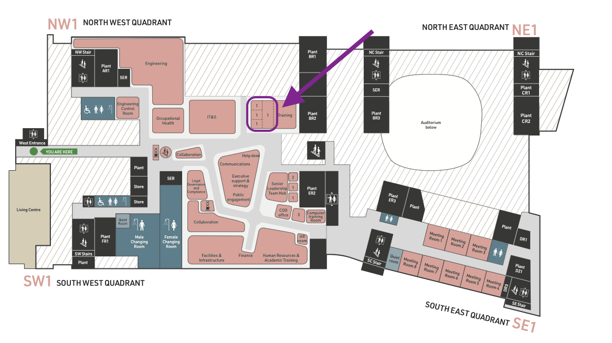

### 5th December 2025, Francis Crick Institute

# Overview

In this workshop, we will bridge the gap between advanced microscopy data generation and the computational skills required for its analysis. By leveraging the popular open-source software [FIJI](https://fiji.sc), participants will learn to automate image analysis, enhancing the precision, efficiency, and reproducibility of their research. This course, led by experienced core facility staff from the Francis Crick Institute, offers a practical approach to mastering quantitative analysis and workflow automation, essential for advancing research across multiple domains.

# Registration

>Registration for this worksop is now closed.

# Instructors
* [Sara Salgueiro Torres, Francis Crick Institute](https://www.crick.ac.uk/research/find-a-researcher/sara-salgueiro-torres)
* [Stefania Marcotti, Francis Crick Institute](https://www.linkedin.com/in/stefania-marcotti/)

# Preparation

1. Please remember to bring your laptop (and charger).
2. Please install the required software before the workshop - follow the installation instructions on [this page](Pages/Installation-Instructions.md).
3. Download the workshop data by clicking on the link to the ZIP archive at the top of this page.
**PLEASE CONTACT SARA BEFORE THE WORKSHOP IF YOU ENCOUNTER ANY DIFFICULTIES WITH ANY OF THE ABOVE.**

# Slides

All the presentation slides for the workshop are accessible will soon be accessible here.

# Program

<table style="width:100%">
	<tbody>
		<tr>
			<th colspan=3>Friday, December 5th 2025</th>
		</tr>
		<tr>
			<td>09:30 - 11:00</td>
			<td>Session 1</td>
			<td>
Introduction to Image Analysis & FIJI
</td>
		</tr>
		<tr>
			<td></td>
			<td colspan=3>
				<ul>
					<li>Sara Salgueiro Torres</li>
					<ul><li>Who are you and why are you here?</li></ul>
					<ul><li>Why manual analysis is a bad idea</li></ul>
					<ul><li>What is metadata and opening images in FIJI</li></ul>
					</ul>
				</ul>
			</td>
		</tr>
		<tr>
			<td>11:00 - 11:15</td>
			<td colspan=2>Coffee Break</td>
		</tr>
		<tr>
			<td>11:15 - 12:45</td>
			<td>Session 2</td>
			<td>
Image Pre-Processing, Segmentation & Analysis
</td>
		</tr>
		<tr>
			<td></td>
			<td colspan=3>
				<ul>
					<li>Sara Salgueiro Torres</li>
					<ul>
						<li>Basic segmentation using thresholding</li>
						<li>Use of filtering to suppress noise</li>
						<li>Obtaining numbers from images</li>
					</ul>
				</ul>
			</td>
		</tr>
		<tr>
			<td>12:45 - 13:45</td>
			<td colspan=2>Lunch</td>
		</tr>
		<tr>
			<td>13:45 - 15:15</td> 
			<td>Session 3</td>
			<td>
Assembling Pipelines & Writing FIJI Macros
</td>
		</tr>
		<tr>
			<td></td>
			<td colspan=3>
			<ul>
				<li>Stefania Marcotti & Sara Salgueiro Torres</li>
				<ul>
					<li>Hands-on: Counting and quantifying morphology and intensity of objects</li>
					<li>Automating pipelines scripting with FIJI macros</li>
				</ul>
			</ul>
			</td>
		</tr>
		<tr>
			<td>15:15 - 15:30</td>
			<td colspan=2>Coffee Break</td>
		</tr>
		<tr>
			<td>15:30 - 17:00</td> 
			<td>Session 4</td>
			<td>
Hands-on macro creation, Q&A, wrap-up
</td>
		</tr>
		<tr>
			<td></td>
			<td colspan=3>
			<ul>
				<li>Sara Salgueiro Torres</li>
				<ul>
					<li>Exercise: automate your workflow with a FIJI macro</li>
					<li>Q&A</li>
					<li>Wrap-up</li>
				</ul>
			</ul>
			</td>
		</tr>
		</tr>
	</tbody>
</table>

# Location

The workshop will take place in Training Room 2 (1st floor):

	

**Please note that this is the smaller of the two training rooms.**

# FAQ

1. **Do I need any prior knowledge of image analysis or FIJI to attend?**

    No, this workshop is aimed at complete beginners, but a basic understanding of image acquisition would be beneficial.

2. **Do I need to have any experience of scripting?**

    While some basic knowledge would be helpful, it's not essential.
   
# Additional Resources

See [here](Pages/Additional-Resources.md) for supplemental workshop material.

	

